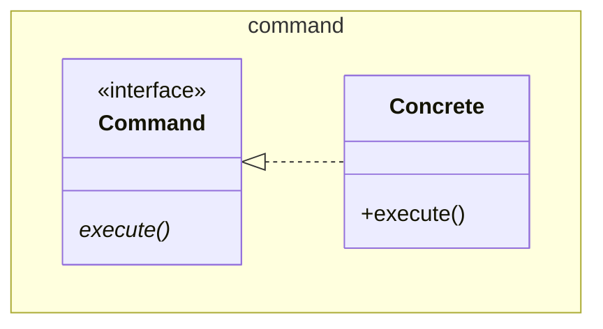

# Command

Also known as Action, Transaction

As an application `Command` pattern is superb, widely used, and well understood.
It is logically equivalent to an `Adapter`.

This is an [Adapter](../../structure/adapter/Adapter.md). The `Command` is the
`Target`, and `Concrete` is the
`Adapter`.

GoF muddies this pattern by showing the caller of the command (`Invoker`) and
the called by `Concrete` (`Receiver`). In the `Adapter` the method is called
`request()`, and here it is called `execute()`.

Perhaps the context is the point.

See also [Composite](../../structure/composite/Composite.md), 
[Memento](../memento/Memento.md), 
[Prototype](../../creation/prototype/Prototype.md)

[Pattern Catalogue](../../Catalogue.md)