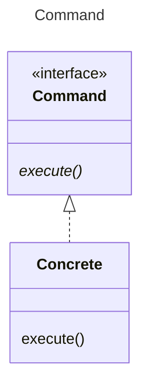

As an application Command pattern is superb, widely used, and well understood. It is logically equivalent to an adapter.

This is an [adapter](../../structure/adapter/Adapter.md). The Command is the Target, and Concrete is the Adapter.

GoF muddies this pattern by showing the caller of the command (Invoker) and the called by concrete (Receiver). In the 
adapter the method is called request, and here it is called execute. 

Perhaps the context is the point. 

[Pattern Catalogue](../../Catalogue.md)