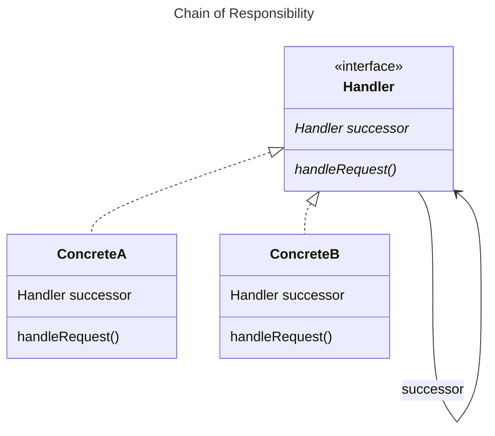

GoF suggests a default implementation that automatically forwards to successor. Don't do this as you will forget to
override the default. We've intentionally made it difficult here by using an interface instead of inheritance.

Handlers can choose to ignore the request or act on it. Further they can pass the request on or not. Possibly
controversially they can mutate the request, or re-route it. 

[Return](../../../../../../../../README.md)