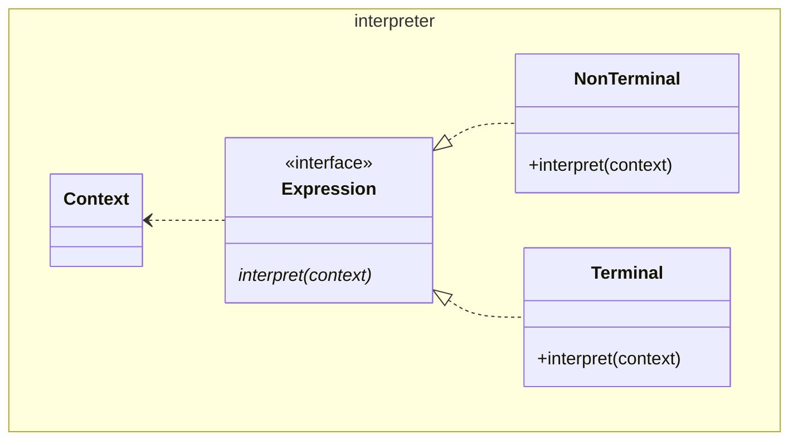

# Interpreter

GoF appends `Expression` to the names of `Terminal`, and `NonTerminal`, and
prefixes `Abstract` to `Expression`. We make `Expression` an interface.

The `Context` is supplied as a parameter to the `interpret()` methods, but this
technique of supplying `Context` is not germain.

GoF recognize this as a special case of the
[Composite](../../structure/composite/Composite.md) pattern (The children being
the various `Terminal`, and `NonTerminal`s). They indicate that the name
should be reserved for where it is used for defining a language. They explicitly
mention document validation as examples just before making this claim. This
larger interpretation would allow application to document validation, and not
only Turing complete hierarchies. I believe this was the intent of GoF.

It appears to me that the presence of the `Context` sufficiently differentiates
this from an "ordinary" composite pattern. I hold that the presence of a 
`Context` is sufficient to call something an `Interpreter`.

See also [Composite](../../structure/composite/Composite.md),
[Flyweight](../../structure/flyweight/Flyweight.md),
[Iterator](../iterator/Iterator.md), [Visitor](../visitor/Visitor.md)

[Pattern Catalogue](../../Catalogue.md)