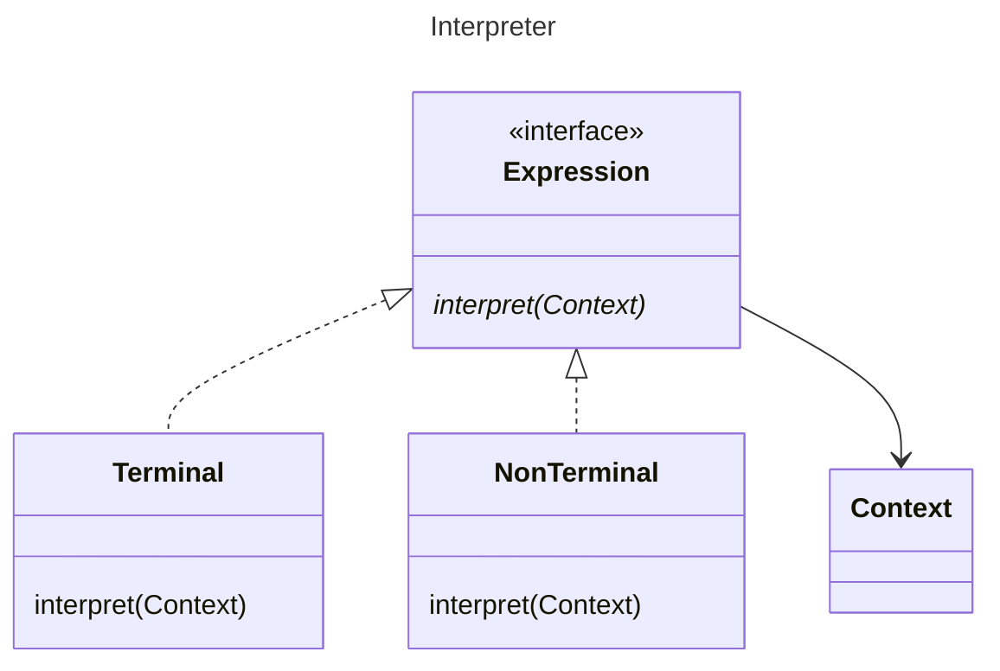

GoF appends Expression to the names of Terminal, and NonTerminal, and prefixes Abstract to Expression. We make 
expression an interface.

The context is supplied as a parameter to the interpret methods, but this technique of supplying context is not germain.

GoF recognise this as a special case of the Composite pattern (The children being the various Terminal, and 
Non-terminals). They indicate that the name should be reserved for where it is used for defining a language.  They 
explicitly mention document validation as examples just before making this claim. This larger interpretation would allow
application to document validation, and not only turing complete hierarchies. I believe this was the intent of GoF.

It appears to me that the presence of the Context sufficiently differentiates this from an "ordinary" composite pattern.
I hold that the presence of a context is sufficient to invoke the moniker of Interpreter.

[Return](../../../../../../../../README.md)