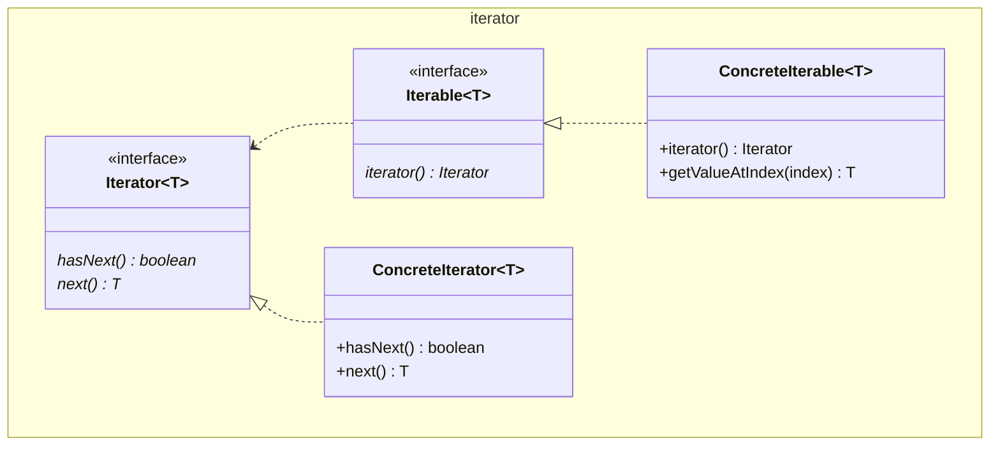

# Interator

Also known as Cursor.

GoF names an `Aggregator` class, we will java-fy it to `Iterable<T>`. GoF calls
the method in `Aggregator` `createIterator()`, we'll use `iterator()`.

On the `Iterator` GoF have a `first()` method. We will omit. GoF also has a
separate `currentItem()` method, we will omit too. We will update `next()` to
return a value of the generic type. GoF calls this is an "Active" Iterator
crediting Grady Booch (1994).

We'll also rename their `isDone()` to `hasNext()`.

GoF suggest making the interface even smaller merging `hasNext()` and returning
a special value. If you are tempted by this optimization don't return a `null`.
You will throw a `Null pointer exception` when you forget to check. Another
sneaky and not recommended option would be to expect a `NoSuchElementException`
to be thrown.

See also [Composite](../../structure/composite/Composite.md), 
[Factory Method](../../creation/factoryMethod/FactoryMethod.md), 
[Mememnto](../memento/Memento.md)

[Pattern Catalogue](../../Catalogue.md)