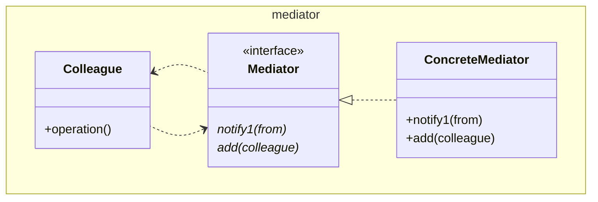

# Mediator

We can't call the method `notify()` since java has a final method `notify()` on
`Object`.

The `Colleague`s communicate with each-other via the interface offered by the
`Mediator`. The `Mediator` communicates with the `Colleague`s via the
`Colleague` interface.

The `Colleague` class could be an interface, and ColleagueA and B implementors,
but for the example `Colleague` is a class, and `A` and `B` instances.

This is an extension of the `Facade` (playing the part of `Mediator`) where the
objects hidden behind the `Facade` also make use of the `Facade` themselves.

See also [Facade](../../structure/facade/Facade.md), 
[Observer](../observer/Observer.md)

[Pattern Catalogue](../../Catalogue.md)