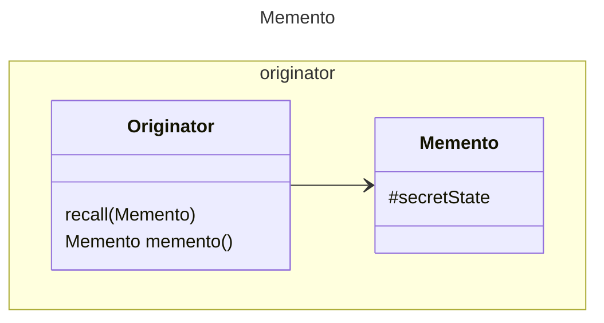

GoF gives Memento a state and getters and setters. We make Memento an interface
and banish all knowledge of what it does to OriginatorMemento. 

The method on Originator is renamed from createMemento to memento(). The method
setMemento is renamed to recall.

OriginatorMemento content must be opaque to the caller. The Memento is something
requested stored and given back.

[Return](../../../../../../../../README.md)