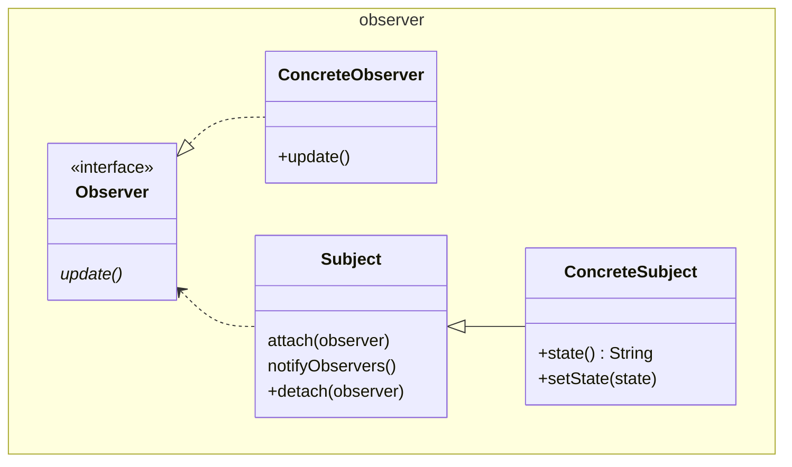

# Observer

Also known as Dependents, Publish/Subscribe

Java has a final `notify()` method on `Object` so we rename to
`notifyObservers()`.

Although pragmatically one might want to address several `Observer`s, but this
is already covered in the [Composite](../../structure/composite/Composite.md)
pattern, so to simplify we only show one `Observer`.

This is the "Pull" model. The `Observer` gets no clue from the notification
about what has changed, and so must "pull" the `state()` it wants from the
`Subject`.

In the "Push" model a detailed state is set with the "notification".

Between this the notifications can be of different granularity. This could be
achieved using different set of notification and state. GoF calls these
"aspects".

A cute way of doing this is to add a generic to `Observer<T>` where `T` is the
`State` of interest. The `Subject` could then only notify `Observer`s declaring
the particular `T`. Since it is an interface, multiple may be declared for the
same `ConcreteObserver`.

See also [Mediator](../mediator/Mediator.md),
[Singleton](../../creation/singleton/Singleton.java)

[Pattern Catalogue](../../Catalogue.md)