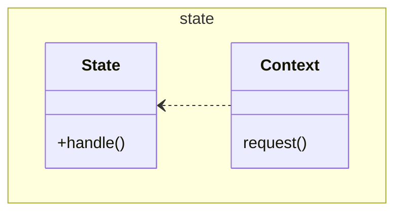

# State

This pattern is associated with "State Transitions".

In the example the transitions are handled by the `Context`. They could be
handled by the `State`s.

Also offered by GoF are table driven approaches credited to Cargill.

See also [Flyweight](../../structure/flyweight/Flyweight.md),
[Singleton](../../creation/singleton/Singleton.md)

[Pattern Catalogue](../../Catalogue.md)