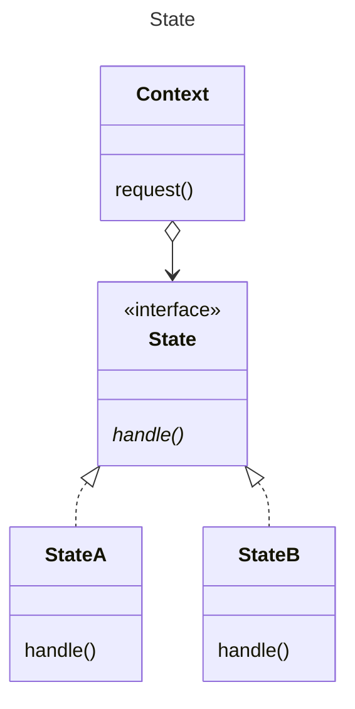

This pattern is associated with State Transitions.

In the example the transistions are handled by the Context. They could be
handled by the states.

Also offered by GoF are table driven approaches credited to Cargill.

[Return](../../../../../../../../README.md)