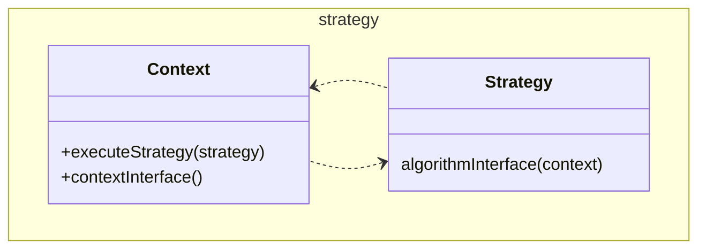

# Strategy

Also known as Policy

```mermaid
classDiagram
namespace strategy {
class Context { 
+executeStrategy(strategy)
+contextInterface()
}
class Strategy { 
algorithmInterface(context)
}
}
Context <.. Strategy
Strategy <.. Context

```

See also [Flyweight](../../structure/flyweight/Flyweight.md)

[Pattern Catalogue](../../Catalogue.md)