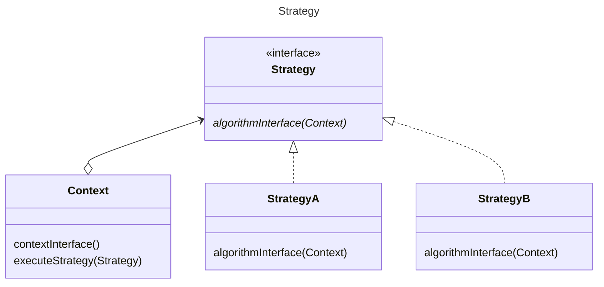

```mermaid
---
title: Strategy
---
classDiagram
    class Context {
        contextInterface()
        executeStrategy(Strategy)
    }
    class Strategy {
        <<interface>>
        algorithmInterface(Context)*
    }
    class StrategyA {
        algorithmInterface(Context)
    }
    class StrategyB {
        algorithmInterface(Context)
    }

    Strategy <--o Context
    Strategy <|.. StrategyA
    Strategy <|.. StrategyB
```

[Return](../../../../../../../../README.md)