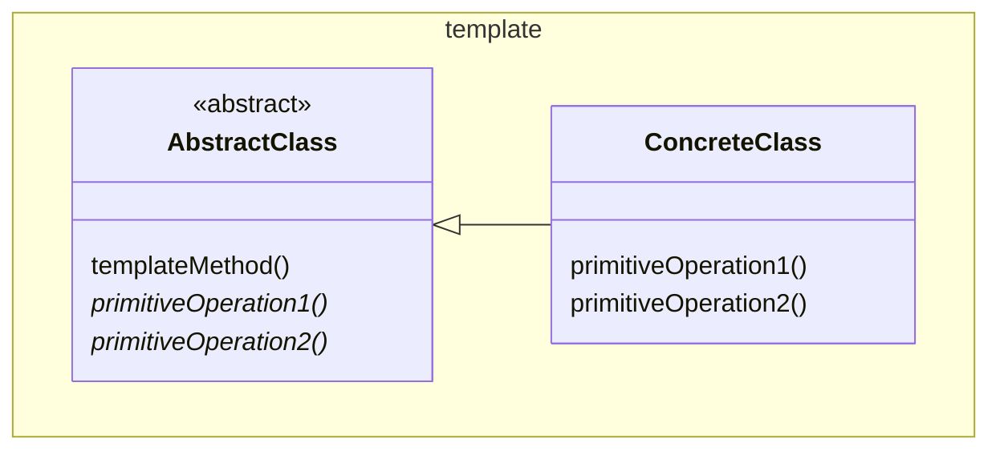

# Template

The `templateMethod()` calls `primitiveOperation1()` and `primitiveOperation2()`
that is implemented in the `ConcreteClass`.

See also [Factory Method](../../creation/factoryMethod/FactoryMethod.md),
[Strategy](../strategy/Strategy.md)

[Pattern Catalogue](../../Catalogue.md)