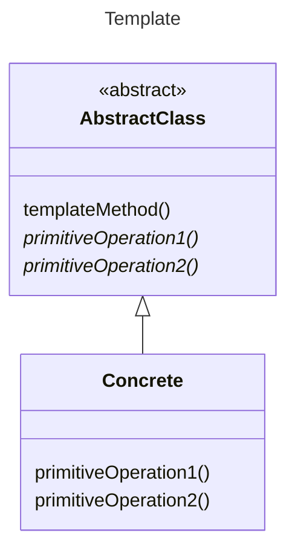

```mermaid
---
title: Template
---
classDiagram
    class AbstractClass {
        <<abstract>>
        templateMethod()
        primitiveOperation1()*
        primitiveOperation2()*
    }
    class Concrete {
        primitiveOperation1()
        primitiveOperation2()
    }
    
    AbstractClass <|-- Concrete
```

[Return](../../../../../../../../README.md)