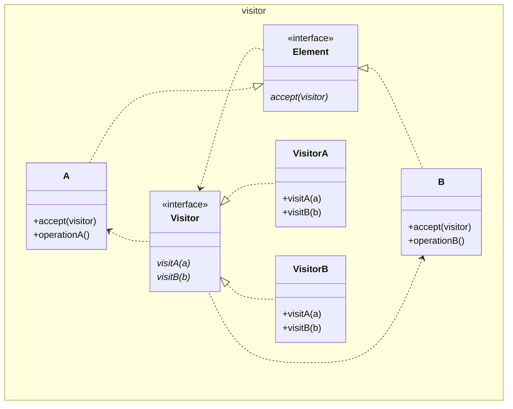

# Visitor

```mermaid
classDiagram
    namespace visitor {
        class A {
            +accept(visitor)
            +operationA()
        }
        class B {
            +accept(visitor)
            +operationB()
        }
        class Element {
            <<interface>>
            accept(visitor)*
        }
        class Visitor {
            <<interface>>
            visitA(a)*
            visitB(b)*
        }
        class VisitorA {
            +visitA(a)
            +visitB(b)
        }
        class VisitorB {
            +visitA(a)
            +visitB(b)
        }
    }
    A <.. Visitor
    B <.. Visitor
    Element <|.. A
    Element <|.. B
    Visitor <.. Element
    Visitor <|.. VisitorA
    Visitor <|.. VisitorB

```

See also [Composite](../../structure/composite/Composite.md),
[Interpreter](../interpreter/Interpreter.md)

[Pattern Catalogue](../../Catalogue.md)