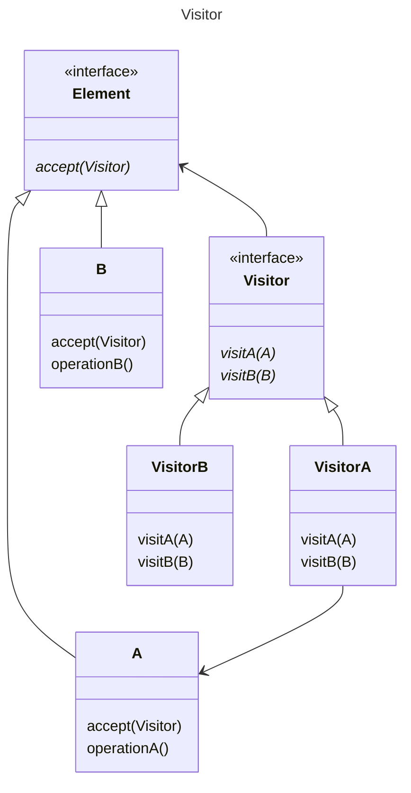

```mermaid
---
title: Visitor
---
classDiagram
    class Visitor {
        <<interface>>
        visitA(A)*
        visitB(B)*
    }
    class Element {
        <<interface>>
        accept(Visitor)*
    }
    class VisitorA {
        visitA(A)
        visitB(B)
    }
    class VisitorB {
        visitA(A)
        visitB(B)
    }
    class A {
        accept(Visitor)
        operationA()
    }
    class B {
        accept(Visitor)
        operationB()
    }
    
    Visitor <|-- VisitorA
    Visitor <|-- VisitorB
    Element <|-- A
    Element <|-- B
    Element <-- Visitor
    VisitorA --> A
```

[Pattern Catalogue](../../Catalogue.md)