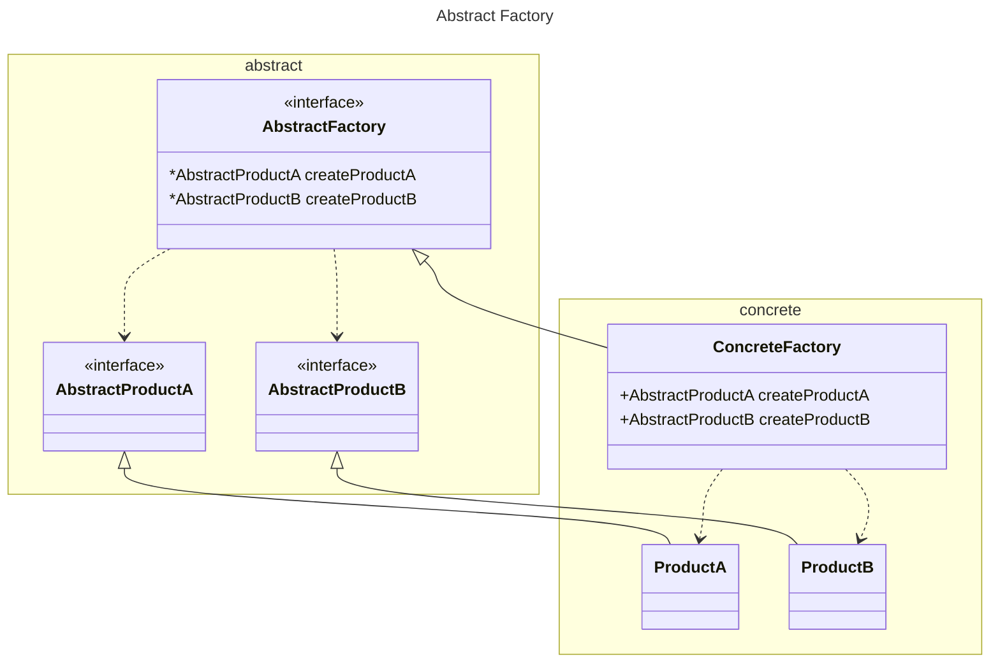

Firstly a note on the name. The class is called AbstractFactory because that is the name of the pattern. Even though in
this incarnation it is an interface. The name of the pattern trumps the property described by the keyword **abstract**,
and besides, using names to indicate properties is poor practice.

The initial abstract factory described in GoF suffers from having a separate method for each class of Product object
created. This tightly couples AbstractFactory to almost everything. In particular the concrete are dependent on the
abstract, and the client is dependent on the abstract.

The first proposal is to use prototypes. This doesn't help the coupling problem.

The second suggestion is to use a single method with a parameter. Uncle Bob suggests, somewhat tongue-in-cheek, breaking
type safety here and just using a string to indicate the class of object we want returned. The problem that the client
(abstract factory users) needs to know the kinds of the products in order to create them remains. The single method
dynamic typing approach does not solve the coupling problem, it merely removes the compilers enforcement of it, and
eventually this failure would be found dynamically at runtime anyway.

By specifying the return types for the separate methods we can at least check the values returned by the separate
methods at compile time whereas the "string" method leaves us retuning some non-specific type. The distinct method calls
also help to ensure that all the required products have been catered for at compile time.

[Return](../../../../../../../../README.md)