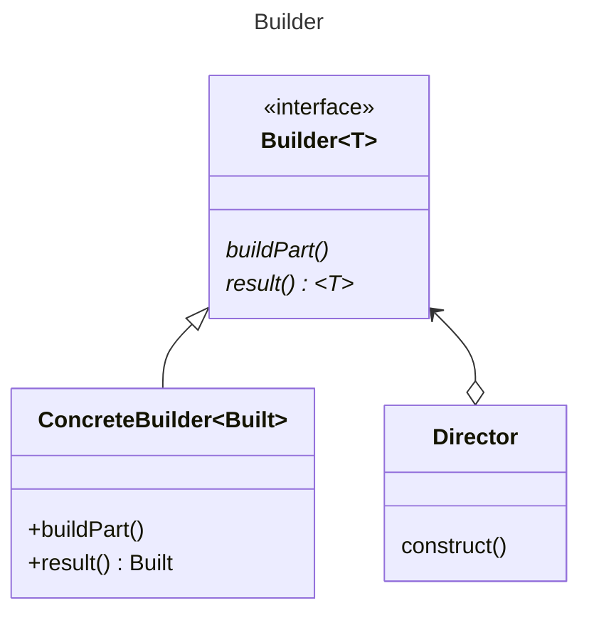

The name of the method that returned the output of the build was called
*getResult()* in GoF. This is a tired mis-convention. It is not our concern if
the output is got, nor calculated, nor generated, nor other such. Here the
method is renamed to *result*. This describes what is returned, and not a
description of the encapsulated implementation that may change, and is not of
interest to the caller.

In the original GoF the getResult method was defined in the ConcreteBuilder and
not in the Builder as the returned type was said to be of types which may not
share any common interface. This is true, but thanks to generics we can capture
a common method returning a specific type to be defined by the implementor.
Thus, the *result()* is moved to the builder.

A suggestion in the original GoF is that the methods be empty rather than
abstract, so that only the needed methods can
be overridden. The converse position is taken here. Until you have decided you
need the method or not the compiler
should complain. Once you have decided you don't need it you can document that
via an empty implementation.

If you are doing TDD and this is your first ConcreteBuilder, then this should
not be a problem as you would only be adding builder methods as you code the
concrete builder test. On your second concrete builder, you could subclass the
original temporarily. If the behaviour is truly common you know what to do. If
the behaviour is empty then that will be documented. Once satisfied the
inheritance can be broken.

Regardless of whether you are doing TDD: Don't extract common empty behaviour to
a superclass. This is a trap, and you will forget to override an empty behaviour
in your subclass.

[Return](../../../../../../../../README.md)
