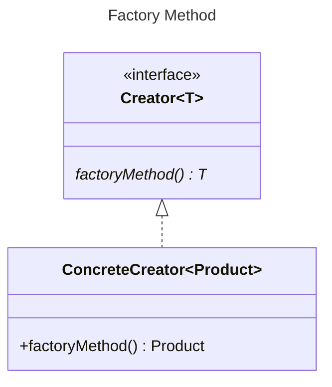

In GoF the ConcreteProduct inherits from an abstract Product. Using generics the
intermediary is unneeded. The name is thus simplified to Product.

Again GoF suggestion to provide a default implementation is to be opposed.

The suggestion to allow parameters on the factory method should be considered.
If there are many varieties consider a [builder](../builder/Builder.md) pattern
is potentially a better fit, as it is logically equivalent to a parameterized
factoryMethod, but with separate methods to define the parameters, and another
to create the object - the result method (exactly a factoryMethod).

[Pattern Catalogue](../../Catalogue.md)