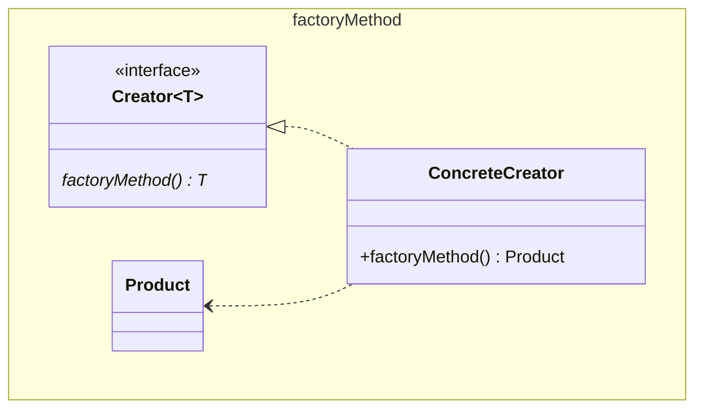

# Factory Method

Also known as Virtual Constructor

In GoF the `Concrete Product` inherits from an abstract `Product`. Using
generics the intermediary is unneeded. The name is thus simplified to `Product`.

GoF suggestion to provide a default implementation is to be opposed.

The suggestion to allow parameters on the factory method should be considered.
If there are many varieties consider a [builder](../builder/Builder.md) pattern
is potentially a better fit, as it is logically equivalent to a parameterized
factoryMethod, but with separate methods to define the parameters, and another
to create the object - the result method (exactly a factoryMethod).

A further lament, is that with proper encapsulation we should not know that this
is creating an object, and if that is the case it is indistinguishable from any
other method that returns an object. In that case what is the point of the 
pattern?

See also [Abstract Factory](../abstractFactory/AbstractFactory.md),
[Template Methods](../../behaviour/template/Template.md),
[Prototype](../prototype/Prototype.md)

[Pattern Catalogue](../../Catalogue.md)