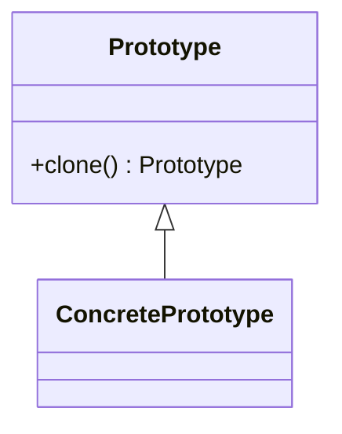

# Prototype

Java already has a clone method defined on `Object`. It throws the checked
exception `CloneableException` if the `Cloneable` interface is not defined. This
means there is a `clone()` method, and as per Java expectations which matches
Liskov Substitution principle there is a chained call to super. Magically this
works.

The most obvious horror with clone is: what do you do in an immutable world?
What use would a clone be? It would seem this pattern is in conflict with
immutability, and could, in this context be an antipattern.

A further ick is if you consider encapsulation, what if you don't know that it
is cloning? It is a factoryMethod that returns an object. If the object is
immutable could it return itself?

# Catalogue

Many of the benefits attributed to this pattern are as a result of a prototype
manager or catalogue. The centrality of this catalog is not emphasized by GoF
and does not seem to match with the offered name nor definition of the prototype
pattern. Another good name for this could be a registry. The trick to this is
that it is simply a collection. Anything that provides a way to get the objects
out can serve as such.

To get he benefits of the catalog, it is not necessary to use prototype objects,
the catalog could be an
[abstractFactory](../abstractFactory/AbstractFactory.md), or a collection of
[factoryMethod](../factoryMethod/FactoryMethod.md).

See also [Abstract Factory](../abstractFactory/AbstractFactory.md),
[Composite](../../structure/composite/Composite.md),
[Decorator](../../structure/decorator/Decorator.md)

[Pattern Catalogue](../../Catalogue.md)