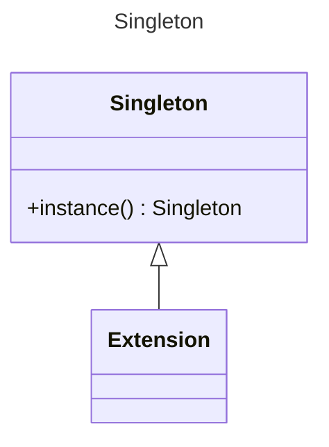

```mermaid
---
title: Singleton
---
classDiagram
    class Singleton {
        +instance() Singleton
    }
    class Extension {
    }
    Singleton <|-- Extension
```
Gof calls the extension SingletonExtension. We have type safety so don't need to embed the type in the name.

[Return](../../../../../../../../README.md)