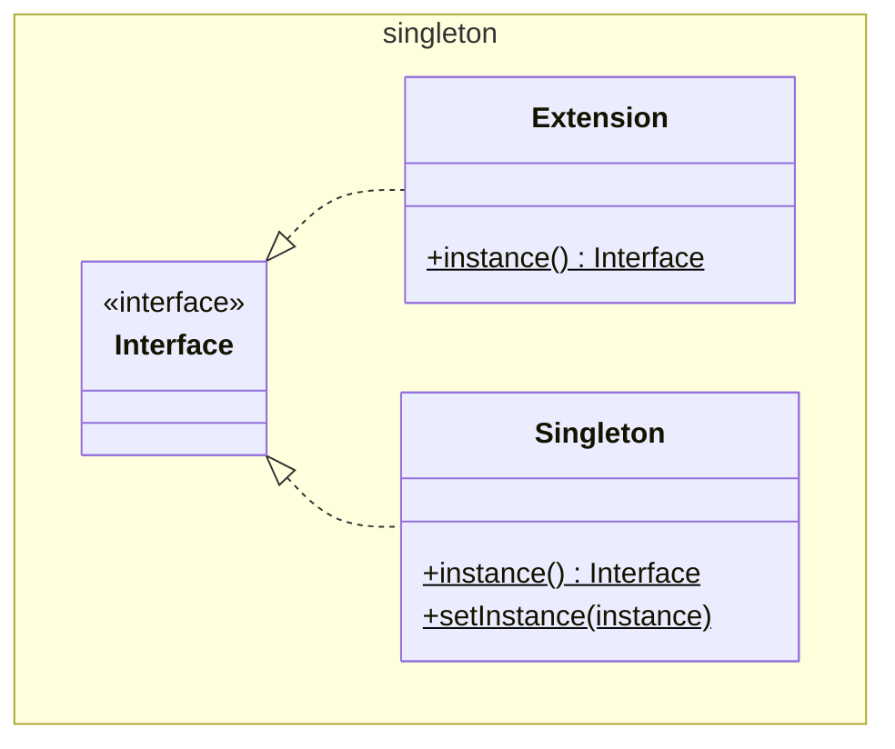

# Singleton

GoF calls the extension `SingletonExtension`. We have type safety so don't need
to embed the type in the name.

GoF also insist that the singleton must be extendable. This makes things messy
in java. We've used an interface and a method to replace the instance.

A more common technique used in javaland is to use a `final static T INSTANCE`
constant, and forget about the extension.

See also [Abstract Factory](../abstractFactory/AbstractFactory.md), 
[Builder](../builder/Builder.md), [Prototype](../prototype/Prototype.md)

[Pattern Catalogue](../../Catalogue.md)