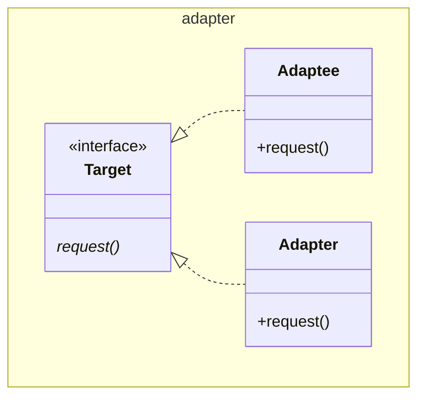

# Adapter

Also known as Wrapper

GoF suggests multiple inheritance, but this is not available in java, and it is
also unnecessary, as we can get away with an interface.

A second alternative where the `Adaptee` is encapsulated in the `Adapter` rather
than inheriting is also proposed in GoF as a way of achieving this pattern
through composition. This appears to be the superior OO option, and it matches
the alternative name (suggested by GoF) "wrapper" more closely.

See also [Bridge](../bridge/Bridge.md), [Decorator](../decorator/Decorator.md),
[Proxy](../proxy/Proxy.md)

[Pattern Catalogue](../../Catalogue.md)