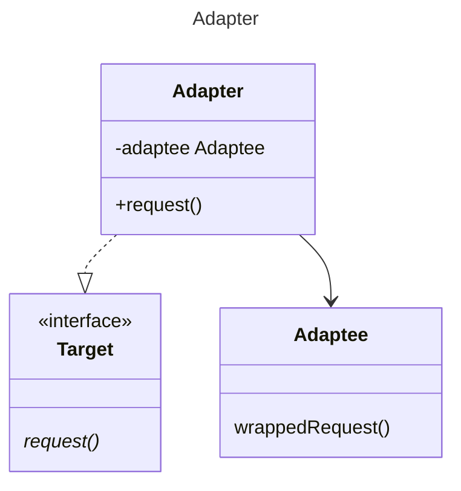

GoF suggests multiple inheritance, but this is not available in java, and it is also unnecessary, as we can get away 
with an interface.

A second alternative where the adaptee is encapsulated in the adapter rather than inheriting is also proposed in GoF as 
a way of achieving this pattern through composition. This appears to be the superior OO option, and it matches the
alternative moniker offered by GoF "wrapper" more closely.

[Return](../../../../../../../../README.md)