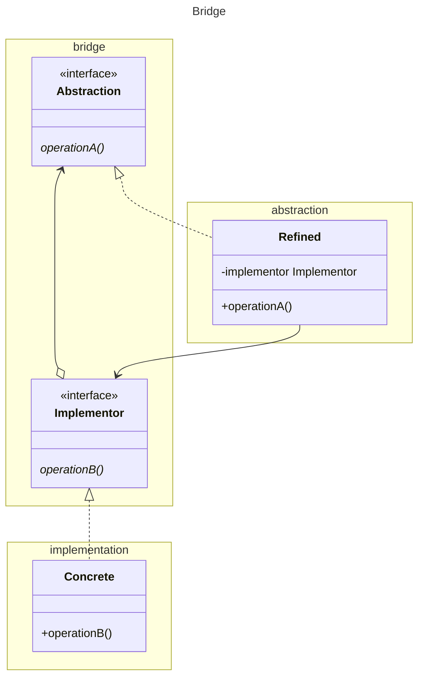

GoF suggest inheritance, but we prefer interfaces. They also suggest the abstraction do the mapping of operations to
implementor. This is better done by refined. In this way the mapping is decoupled from the bridge package, and can be
changed without recompiling and redeploying the bridge package. 

The concrete class is decoupled through the implementor interface.

[Return](../../../../../../../../README.md)