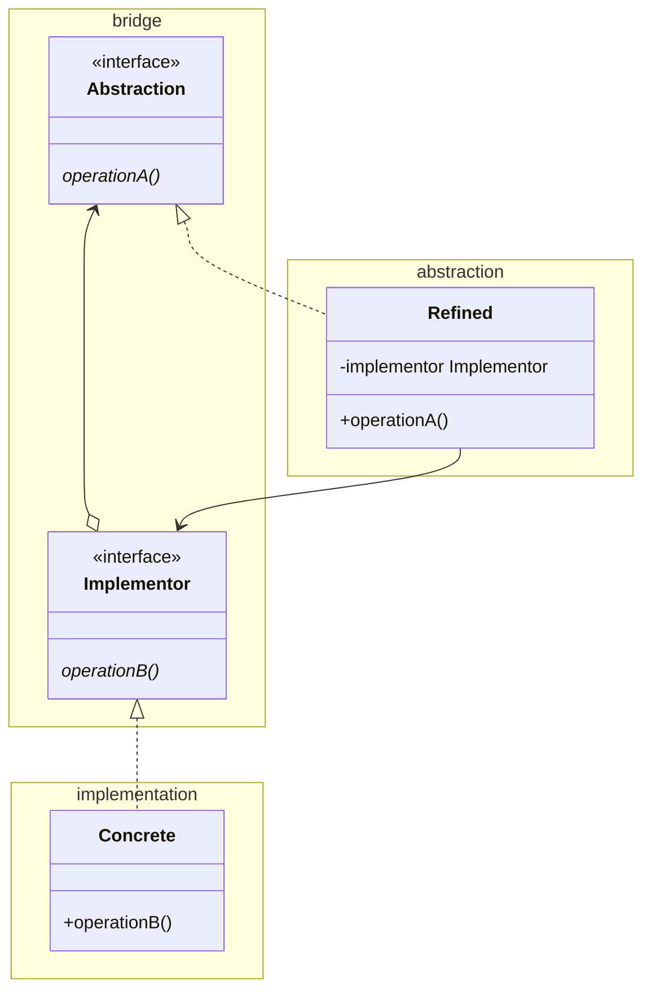

# Bridge

Also known as Handle/Body

GoF suggest inheritance, but we prefer interfaces. They also suggest the
`Abstraction` do the mapping of operations to `Implementor`. This is better done
by `Refined`. In this way the mapping is decoupled from the bridge package, and
can be changed without recompiling and redeploying the bridge package.

The `Concrete` class is decoupled through the implementor interface.

See also [Abstract Factory](../../creation/abstractFactory/AbstractFactory.md), 
[Adapter](../adapter/Adapter.md)

[Pattern Catalogue](../../Catalogue.md)