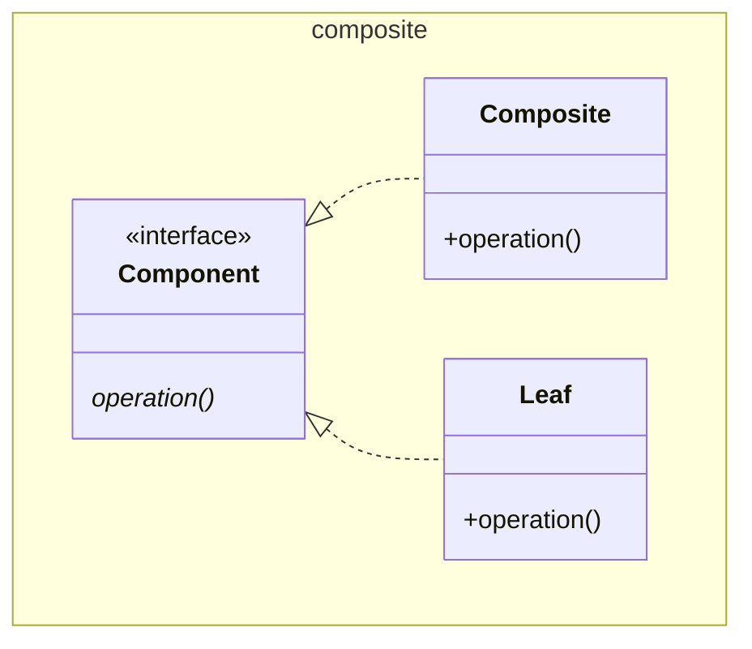

# Composite

GoF shows `Component` effectively an interface and the `Leaf` implementing
operation, and `Composite` implementing all methods. This is ugly as it means
`Leaf` has vestigial methods for dealing with the children meaningfully
implemented in `Composite`. A clear violation of the interface segregation
principle.

Here the child manipulation methods are stripped out of `Component`, and
`Composite`. The stripped methods are moved to `Collection` (a java collection,
not shown). We use generics to tie the type of the collection to the component
interface.

See also [Command](../../behaviour/command/Command.md), 
[Chain of Responsibility](../../behaviour/cor/ChainOfResponsibility.md), 
[Decorator](../decorator/Decorator.md), [Flyweight](../flyweight/Flyweight.md), 
[Iterator](../../behaviour/iterator/Iterator.md), 
[Visitor](../../behaviour/visitor/Visitor.md)

[Pattern Catalogue](../../Catalogue.md)