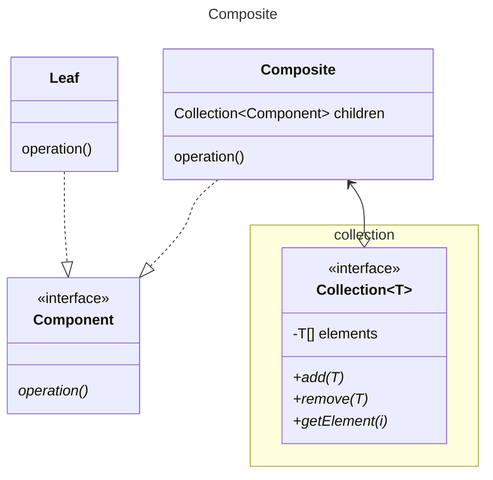

GoF shows component effectively an interface and the leaf implementing operation, and composite implementing all methods
This is ugly as it means Leaf has vestigial methods for dealing with the children meaningfully implemented in composite.
A clear violation of the interface segregation principle.

Here the child manipulation methods are stripped out of component, and composite. The stripped methods are moved to
collection. We use generics to tie the type of the collection to the component interface. 

[Return](../../../../../../../../README.md)