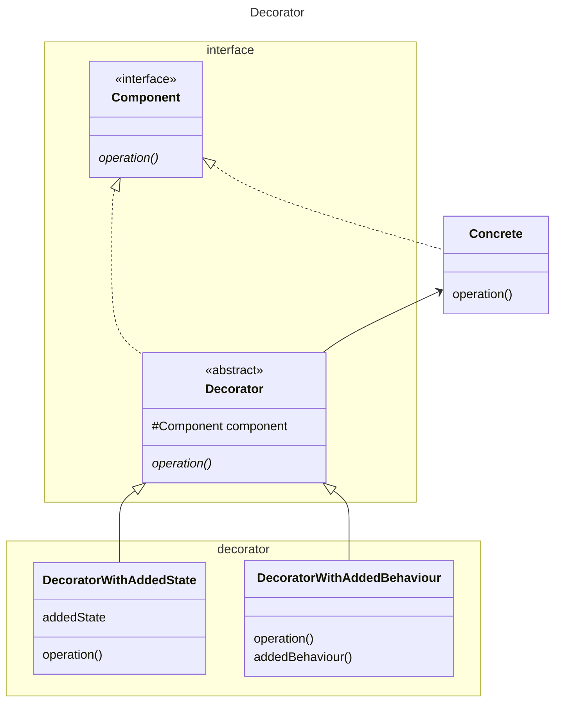

This pattern looks similar to the [adapter / wrapper](../adapter/Adapter.md). It is specifically the implementation of 
the same interface as the adaptee (Concrete) that differentiates this pattern from that one. 

The decorator package is independently deployable, and separately so are the concrete classes.

As GoF themselves mention a decorator can be viewed as a degenerate [composite](../composite/Composite.md) with only one
child.

In a simpler version the decorator could inherit directly from Concrete, but this introduces coupling.

[Return](../../../../../../../../README.md)