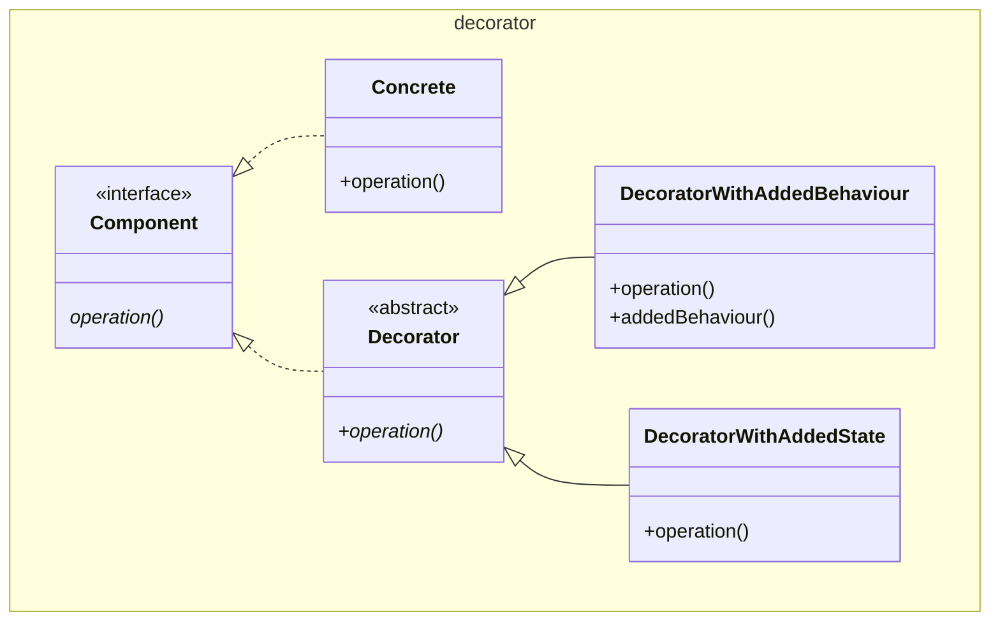

# Decorator

Also known as Wrapper

This pattern looks similar to the [adapter / wrapper](../adapter/Adapter.md). It
is specifically the implementation of the same interface as the `Adaptee` 
(`Concrete`) that differentiates this pattern from that one.

The `DecoratorWithAddedBehaviour` and `DecoratorWithAddedState` are 
independently deployable, and separately so are the `Concrete` classes.

As GoF themselves mention a `Decorator` can be viewed as a degenerate
[Composite](../composite/Composite.md) with only one child.

In a simpler version the `Decorator` could inherit directly from `Concrete`, but
that would introduce coupling.

[Pattern Catalogue](../../Catalogue.md)
