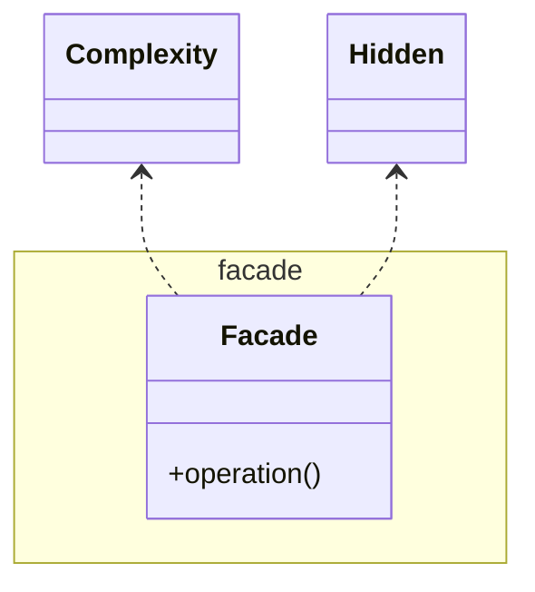

# Facade

See also [Abstract Factory](../../creation/abstractFactory/AbstractFactory.md),
[Mediator](../../behaviour/mediator/Mediator.md),
[Singleton](../../creation/singleton/Singleton.md)

[Pattern Catalogue](../../Catalogue.md)