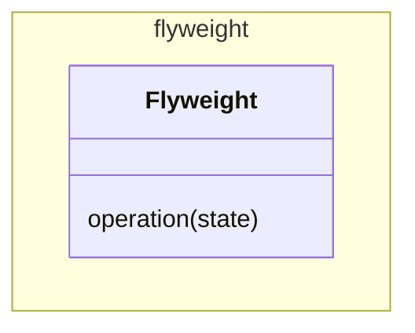

# Flyweight

In GoF the pattern is complicated with a factory, this is not germain to the
pattern.

See also [Composite](../composite/Composite.md), 
[State](../../behaviour/state/State.md),
[Strategy](../../behaviour/strategy/Strategy.md) 

[Pattern Catalogue](../../Catalogue.md)