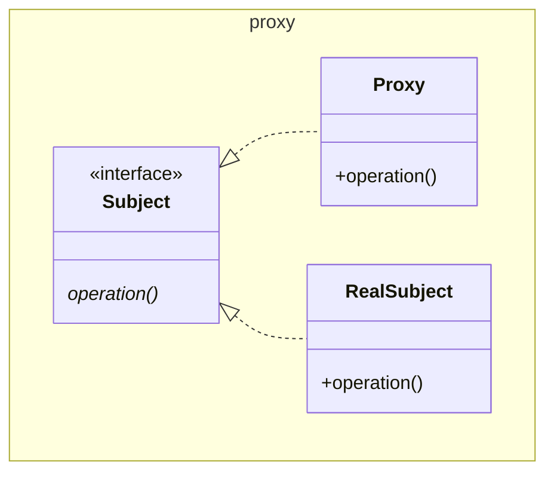

# Proxy

Also known as Surrogate

GoF posits a `request()` method, here we call it `operation()` for consistency
with other patterns.

This is essentially a [Decorator](../decorator/Decorator.md) pattern, as
mentioned in GoF. The `Proxy` acts as a stand in for the `RealSubject`. The
`Proxy` can add behaviour such as:

* remote proxy - a local stand in for a remote object
* virtual proxy - acts as a stand in where possible and only creates / calls the
  `RealSubject` when needed.
* protection proxy - controls access to the real subject
* smart reference - counts, locks, or lazily loads the subject on demand

See also [Adapter](../adapter/Adapter.md),
[Decorator](../decorator/Decorator.md)

[Pattern Catalogue](../../Catalogue.md)