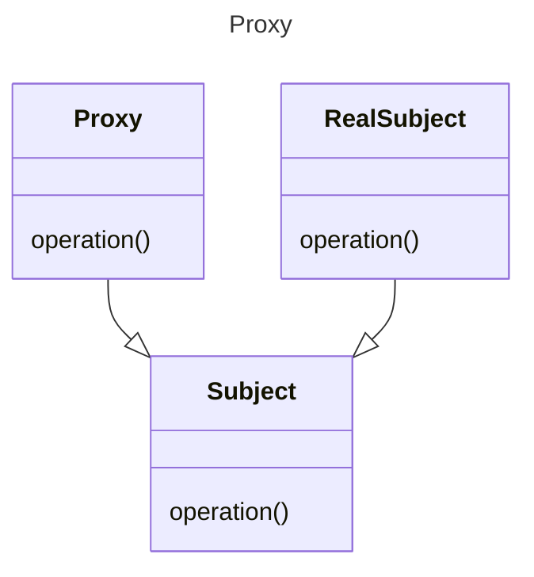

GoF posits a request method, here we call it operation for consistency with the
other patterns.

This is essentially a decorator pattern, as mentioned in GoF. The proxy acts as
a stand in for the RealSubject. The
proxy can add behaviour such as:

* remote proxy - a local stand in for a remote object
* virtual proxy - acts as a stand in where possible and only creates / calls the
  RealSubject when needed.
* protection proxy - controls access to the real subject
* smart reference - counts, locks, or lazily loads the subject on demand

[Pattern Catalogue](../../Catalogue.md)